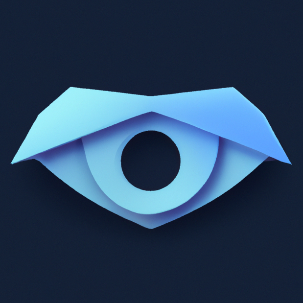

# Twenty - A small Rust App to help you with eye strain

This app is intended as a small native application written in Rust to remind you every 20 minutes to look at something 20ft (6m) away. This helps to reduce eye strain when working a lot with screens.

Uses [iced-rs](https://github.com/iced-rs/iced/tree/master) for the frontend.